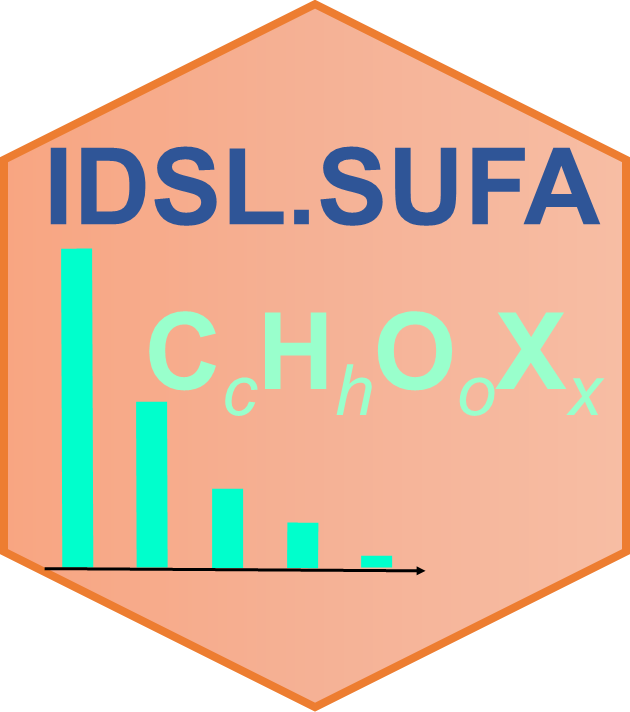

# IDSL.SUFA

<!-- badges: start -->

<!-- badges: end -->

A simplified version of the 'IDSL.UFA' package to calculate isotopic profiles and adduct formulas from molecular formulas with no dependency on other R packages for online tools. The IDSL.SUFA package has functions to process user-defined adduct formulas.

	install.packages("IDSL.SUFA")

## Workflow
Main function:

	isotopic_profile_molecular_formula_feeder_simplified(molecular_formula,
	IonPathways = "[M]+", peak_spacing = 0, intensity_cutoff = 1)
	
	formula_adduct_calculator(molecular_formula, IonPathways)

***molecular_formula:*** A molecular formulas

***IonPathways:*** An ionization pathway. Pathways should be like [Coeff*M+ADD1-DED1+...] where "Coeff" should be an integer between 1-9 and ADD1 and DED1 may be ionization pathways. ex: 'IonPathways <- c("[M]+", "[M+H]+", "[2M-Cl]-", "[3M+CO2-H2O+Na-KO2+HCl-NH4]-")'

***peak_spacing:*** A maximum space between isotopologues in *Da* to merge neighboring isotopologues.

***intensity_cutoff:*** A minimum intensity threshold for isotopic profiles in percentage.

##
**example 1:** Isotopic profile of water

	Isotopic_Profile <- isotopic_profile_molecular_formula_feeder_simplified(molecular_formula = "H2O")
##	
**example 2:** PFOA (C8HF15O2) losing carboxylic acid group
	
	Adduct_Formula <- formula_adduct_calculator(molecular_formula = "C8HF15O2", IonPathways = "[M-HCO2]-")

##
Visit https://ipc.idsl.me/ to see the isotopic profile calculation interface

## Citation
Fakouri Baygi, S., Kumar, Y. Barupal, D.K. [IDSL.UFA assigns high confidence molecular formula annotations for untargeted LC/HRMS datasets in metabolomics and exposomics](https://www.biorxiv.org/content/10.1101/2022.02.02.478834v2). *bioRxiv*, **2022**.

